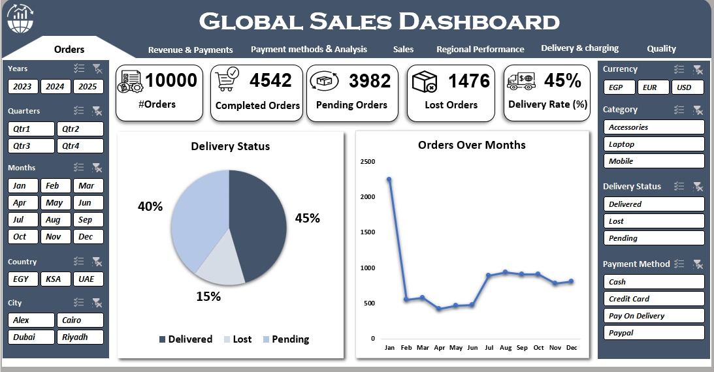
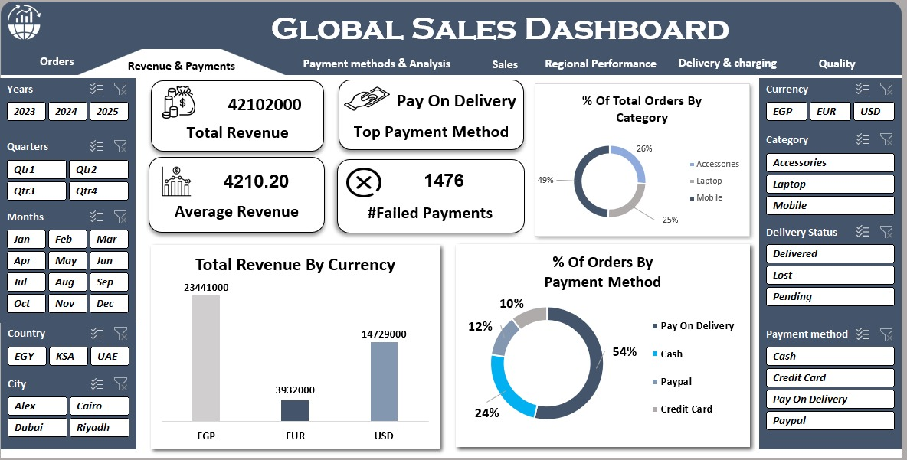
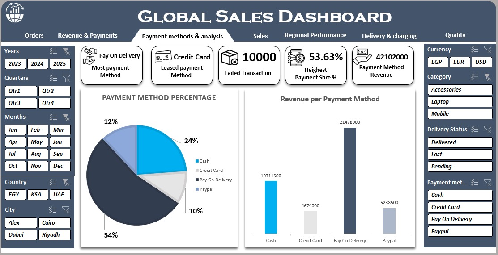
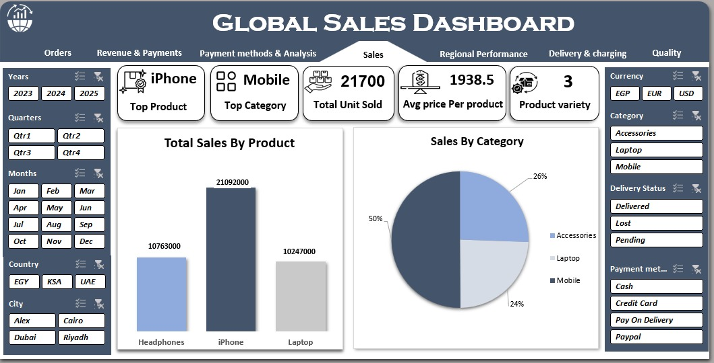
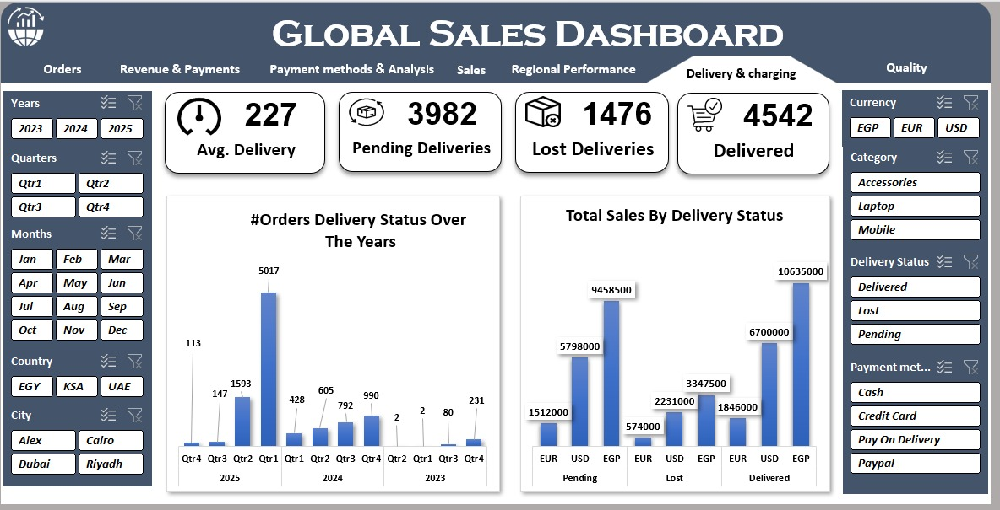
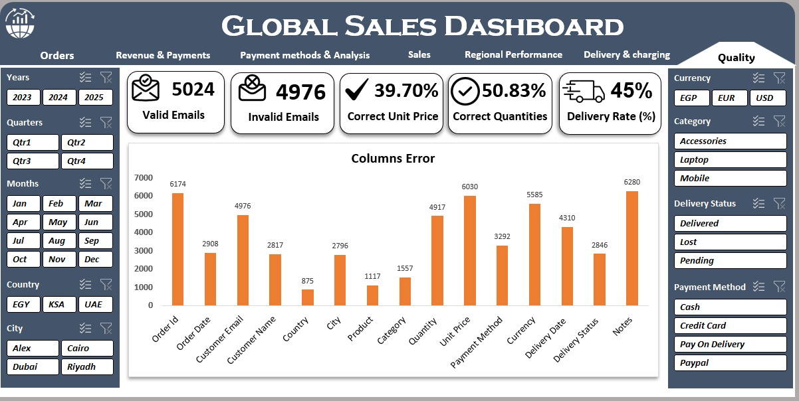

# Adham Osama | Data Analyst Portfolio

## 🧠 About Me
I'm Adham Osama, a Computer Science student passionate about Data Analysis.  
Currently building skills in Excel, Power Query, and data visualization.  
This portfolio showcases some of the dashboards I’ve built during my learning journey.

---

## 📂 Projects

#### 🌍📈 Global Sales Dashboard

## 📊 Global Sales Dashboard

  
  
  
  
  
  

#### 🚲 Bike Sales Dashboard

- ⚙ *Technologies Used:* Excel 
- 📊 A dashboard analyzing seasonal bike sales across customer types and product colors.
- 🎯 Focuses on identifying best-selling categories and peak sales seasons.

---

#### 🛒 Market Sales Dashboard

- ⚙ *Technologies Used:* Excel  
- 📈 A dashboard tracking total sales, profits, and monthly performance.
- 🌍 Includes segmentation by region and product type.

---

## 📫 Contact Me

- 📧 Email: adhamosama923@gmail.com  
- 🔗 [LinkedIn](https://www.linkedin.com/in/adham-osama-1666bb323)

